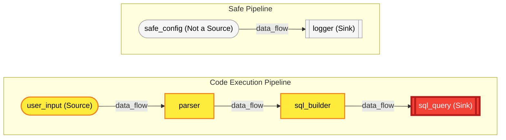
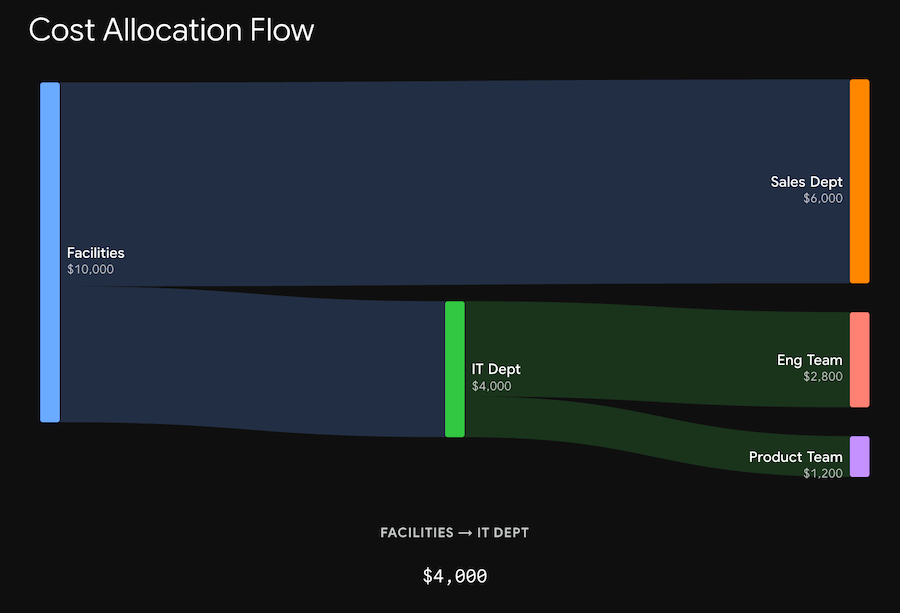

<!-- livebook:{"file_entries":[{"name":"Cash-Allocation-Flow.png","type":"attachment"},{"name":"CashFlowAllocation3.png","type":"attachment"}],"persist_outputs":true} -->

# ExDatalog Examples

```elixir
Mix.install([
    {:ex_datalog, path: Path.expand("..", __DIR__), env: :prod},
])
```

## Introduction

Here are a dozen _"realistic"_ use cases for the ex_datalog library. Datalog shines in scenarios involving recursive graphs, hierarchical relationships, constraints, and pattern matching.

## Setup

```elixir
alias ExDatalog
alias ExDatalog.{Program, Knowledge}
```

<!-- livebook:{"output":true} -->

```
[ExDatalog.Program, ExDatalog.Knowledge]
```

---

## 1. Role-Based Access Control (RBAC) & Authorization

**Use Case:** Modern applications often have complex authorization rules where roles inherit permissions from parent roles. Datalog can easily resolve the transitive closure of role inheritance to definitively answer _"Does user X have role Y?"_

```elixir
program =
  Program.new()
  |> Program.add_relation("role_parent", [:atom, :atom])
  |> Program.add_relation("user_direct_role", [:atom, :atom])
  |> Program.add_relation("has_role", [:atom, :atom])
  # A user has a role if assigned directly
  |> Program.add_rule(
    {"has_role", [:User, :Role]},
    [{:positive, {"user_direct_role", [:User, :Role]}}]
  )
  # A user has a role if they have a parent role that grants it
  |> Program.add_rule(
    {"has_role", [:User, :Role]},
    [
      {:positive, {"has_role", [:User, :ParentRole]}},
      {:positive, {"role_parent", [:ParentRole, :Role]}}
    ]
  )

```

<!-- livebook:{"output":true} -->

```
%ExDatalog.Program{
  relations: %{
    "has_role" => %{arity: 2, types: [:atom, :atom]},
    "role_parent" => %{arity: 2, types: [:atom, :atom]},
    "user_direct_role" => %{arity: 2, types: [:atom, :atom]}
  },
  facts: [],
  rules: [
    %ExDatalog.Rule{
      head: %ExDatalog.Atom{relation: "has_role", terms: [var: "User", var: "Role"]},
      body: [
        positive: %ExDatalog.Atom{relation: "has_role", terms: [var: "User", var: "ParentRole"]},
        positive: %ExDatalog.Atom{relation: "role_parent", terms: [var: "ParentRole", var: "Role"]}
      ],
      constraints: []
    },
    %ExDatalog.Rule{
      head: %ExDatalog.Atom{relation: "has_role", terms: [var: "User", var: "Role"]},
      body: [
        positive: %ExDatalog.Atom{relation: "user_direct_role", terms: [var: "User", var: "Role"]}
      ],
      constraints: []
    }
  ]
}
```

#### The Knowledge

This dataset models a three-tier role hierarchy (admin, editor, viewer) and assigns three users to distinct levels. It demonstrates how high-level permissions naturally cascade down to include lower-level access rights. Here Alice inherits `:editor` and `:viewer` through `:admin`

```elixir
{:ok, knowledge} =
  program
  |> Program.add_fact("role_parent", [:admin, :editor])
  |> Program.add_fact("role_parent", [:editor, :viewer])
  |> Program.add_fact("user_direct_role", [:alice, :admin])
  |> Program.add_fact("user_direct_role", [:bob, :editor])
  |> Program.add_fact("user_direct_role", [:charlie, :viewer])
  |> ExDatalog.materialize()
```

<!-- livebook:{"output":true} -->

```
{:ok,
 %ExDatalog.Knowledge{
   relations: %{
     "has_role" => MapSet.new([
       alice: :admin,
       alice: :editor,
       alice: :viewer,
       bob: :editor,
       bob: :viewer,
       charlie: :viewer
     ]),
     "role_parent" => MapSet.new([admin: :editor, editor: :viewer]),
     "user_direct_role" => MapSet.new([alice: :admin, bob: :editor, charlie: :viewer])
   },
   stats: %{
     capabilities: %ExDatalog.Capabilities{
       storage_type: :map,
       indexed_lookup: false,
       concurrent_reads: false,
       arithmetic_constraints: true,
       comparison_constraints: true,
       type_predicates: true,
       string_predicates: true,
       provenance: true,
       external_execution: false
     },
     duration_us: 4760,
     iterations: 3,
     relation_sizes: %{"has_role" => 6, "role_parent" => 2, "user_direct_role" => 3}
   },
   provenance: nil
 }}
```

Find all roles assigned to a specific user:

```elixir
# Returns all roles (direct and inherited) for :alice
MapSet.new([alice: :admin, alice: :editor, alice: :viewer]) ==
    Knowledge.match(knowledge, "has_role", [:alice, :_])
```

<!-- livebook:{"output":true} -->

```
true
```

Find all users who hold a specific privileged role:

```elixir
# Useful for auditing who has admin access
MapSet.new([alice: :admin]) == Knowledge.match(knowledge, "has_role", [:_, :admin])
```

<!-- livebook:{"output":true} -->

```
true
```

Verify a specific permission:

```elixir
# Authorization check gate: Does Bob have the editor role?
MapSet.new([bob: :editor]) == Knowledge.match(knowledge, "has_role", [:bob, :editor])
```

<!-- livebook:{"output":true} -->

```
true
```

---

## 2. Supply Chain / Bill of Materials (BOM) Tracking

**Use Case:** Manufacturing and software supply chains need to know if a defective or vulnerable sub-component affects a finished product. This defines a structural BOM. An assembly contains a part if it uses it directly, or if it uses a sub-component that contains that part.

```elixir
program =
  Program.new()
  |> Program.add_relation("direct_component", [:atom, :atom])
  |> Program.add_relation("contains_part", [:atom, :atom])
  # Base case: The assembly directly includes the part
  |> Program.add_rule(
    {"contains_part", [:Assembly, :Part]},
    [{:positive, {"direct_component", [:Assembly, :Part]}}]
  )
  # Recursive case: The assembly includes a component that includes the part
  |> Program.add_rule(
    {"contains_part", [:Assembly, :SubPart]},
    [
      {:positive, {"contains_part", [:Assembly, :Component]}},
      {:positive, {"direct_component", [:Component, :SubPart]}}
    ]
  )
```

<!-- livebook:{"output":true} -->

```
%ExDatalog.Program{
  relations: %{
    "contains_part" => %{arity: 2, types: [:atom, :atom]},
    "direct_component" => %{arity: 2, types: [:atom, :atom]}
  },
  facts: [],
  rules: [
    %ExDatalog.Rule{
      head: %ExDatalog.Atom{relation: "contains_part", terms: [var: "Assembly", var: "SubPart"]},
      body: [
        positive: %ExDatalog.Atom{
          relation: "contains_part",
          terms: [var: "Assembly", var: "Component"]
        },
        positive: %ExDatalog.Atom{
          relation: "direct_component",
          terms: [var: "Component", var: "SubPart"]
        }
      ],
      constraints: []
    },
    %ExDatalog.Rule{
      head: %ExDatalog.Atom{relation: "contains_part", terms: [var: "Assembly", var: "Part"]},
      body: [
        positive: %ExDatalog.Atom{
          relation: "direct_component",
          terms: [var: "Assembly", var: "Part"]
        }
      ],
      constraints: []
    }
  ]
}
```

#### The Knowledge

Let's model the classic manufacturing example of a bicycle. A hierarchical manufacturing tree where a finished bicycle requires top-level assemblies (like wheel_assembly), which are themselves composed of raw materials (like spokes and rim).

```elixir
{:ok, knowledge} =
  program
  |> Program.add_fact("direct_component", [:bicycle, :frame_assembly])
  |> Program.add_fact("direct_component", [:bicycle, :wheel_assembly])
  |> Program.add_fact("direct_component", [:frame_assembly, :frame])
  |> Program.add_fact("direct_component", [:frame_assembly, :fork])
  |> Program.add_fact("direct_component", [:frame_assembly, :handlebars])
  |> Program.add_fact("direct_component", [:wheel_assembly, :tire])
  |> Program.add_fact("direct_component", [:wheel_assembly, :rim])
  |> Program.add_fact("direct_component", [:wheel_assembly, :spokes])
  |> ExDatalog.materialize()
```

<!-- livebook:{"output":true} -->

```
{:ok,
 %ExDatalog.Knowledge{
   relations: %{
     "contains_part" => MapSet.new([
       bicycle: :fork,
       bicycle: :frame,
       bicycle: :frame_assembly,
       bicycle: :handlebars,
       bicycle: :rim,
       bicycle: :spokes,
       bicycle: :tire,
       bicycle: :wheel_assembly,
       frame_assembly: :fork,
       frame_assembly: :frame,
       frame_assembly: :handlebars,
       wheel_assembly: :rim,
       wheel_assembly: :spokes,
       wheel_assembly: :tire
     ]),
     "direct_component" => MapSet.new([
       bicycle: :frame_assembly,
       bicycle: :wheel_assembly,
       frame_assembly: :fork,
       frame_assembly: :frame,
       frame_assembly: :handlebars,
       wheel_assembly: :rim,
       wheel_assembly: :spokes,
       wheel_assembly: :tire
     ])
   },
   stats: %{
     capabilities: %ExDatalog.Capabilities{
       storage_type: :map,
       indexed_lookup: false,
       concurrent_reads: false,
       arithmetic_constraints: true,
       comparison_constraints: true,
       type_predicates: true,
       string_predicates: true,
       provenance: true,
       external_execution: false
     },
     duration_us: 98,
     iterations: 2,
     relation_sizes: %{"contains_part" => 14, "direct_component" => 8}
   },
   provenance: nil
 }}
```

**Full BOM Expansion (What is this made of?)**:
Extract the complete, flattened list of every single component and sub-assembly required to build a bicycle.

```elixir
Knowledge.match(knowledge, "contains_part", [:bicycle, :_])
```

<!-- livebook:{"output":true} -->

```
MapSet.new([
  bicycle: :fork,
  bicycle: :frame,
  bicycle: :frame_assembly,
  bicycle: :handlebars,
  bicycle: :rim,
  bicycle: :spokes,
  bicycle: :tire,
  bicycle: :wheel_assembly
])
```

**Where-Used Analysis (Where does this go?):** Find every assembly or finished product that relies on a specific raw material (e.g., if you are running low on spokes).

```elixir
Knowledge.match(knowledge, "contains_part", [:_, :spokes])
```

<!-- livebook:{"output":true} -->

```
MapSet.new([bicycle: :spokes, wheel_assembly: :spokes])
```

**Direct Sub-components Only**:
Look at the immediate recipe for a specific sub-assembly without fully expanding the rest of the tree.

```elixir
Knowledge.match(knowledge, "direct_component", [:frame_assembly, :_])
```

<!-- livebook:{"output":true} -->

```
MapSet.new([frame_assembly: :fork, frame_assembly: :frame, frame_assembly: :handlebars])
```

---

## 3. Social Network "Friend Recommendations"

**Use Case:** Finding "Friends of Friends" to suggest as connections, but filtering out people who are already directly friends using ex_datalog's stratified negation.

```elixir
program =
  Program.new()
  |> Program.add_relation("friend", [:atom, :atom])
  |> Program.add_relation("recommendation", [:atom, :atom])
  |> Program.add_rule(
    {"recommendation", [:A, :C]},
    [
      {:positive, {"friend", [:A, :B]}},
      {:positive, {"friend", [:B, :C]}},
      {:negative, {"friend", [:A, :C]}}
    ],
    # Prevent recommending someone to themselves
    [{:neq, :A, :C}]
  )
```

<!-- livebook:{"output":true} -->

```
%ExDatalog.Program{
  relations: %{
    "friend" => %{arity: 2, types: [:atom, :atom]},
    "recommendation" => %{arity: 2, types: [:atom, :atom]}
  },
  facts: [],
  rules: [
    %ExDatalog.Rule{
      head: %ExDatalog.Atom{relation: "recommendation", terms: [var: "A", var: "C"]},
      body: [
        positive: %ExDatalog.Atom{relation: "friend", terms: [var: "A", var: "B"]},
        positive: %ExDatalog.Atom{relation: "friend", terms: [var: "B", var: "C"]},
        negative: %ExDatalog.Atom{relation: "friend", terms: [var: "A", var: "C"]}
      ],
      constraints: [
        %ExDatalog.Constraint{op: :neq, left: {:var, "A"}, right: {:var, "C"}, result: nil}
      ]
    }
  ]
}
```

A small social graph of four users where relationships naturally overlap. It specifically includes a pre-existing friendship between Alice and Dave to test how negation successfully filters out redundant recommendations.

<!-- livebook:{"break_markdown":true} -->

#### The Knowledge

```elixir
{:ok, knowledge} =
  program
  |> Program.add_fact("friend", [:alice, :bob])
  |> Program.add_fact("friend", [:bob, :charlie])
  |> Program.add_fact("friend", [:bob, :dave])
  # Alice is already friends with Dave, so he shouldn't be recommended
  |> Program.add_fact("friend", [:alice, :dave])
  |> ExDatalog.materialize()


```

<!-- livebook:{"output":true} -->

```
{:ok,
 %ExDatalog.Knowledge{
   relations: %{
     "friend" => MapSet.new([alice: :bob, alice: :dave, bob: :charlie, bob: :dave]),
     "recommendation" => MapSet.new([alice: :charlie])
   },
   stats: %{
     capabilities: %ExDatalog.Capabilities{
       storage_type: :map,
       indexed_lookup: false,
       concurrent_reads: false,
       arithmetic_constraints: true,
       comparison_constraints: true,
       type_predicates: true,
       string_predicates: true,
       provenance: true,
       external_execution: false
     },
     duration_us: 3108,
     iterations: 1,
     relation_sizes: %{"friend" => 4, "recommendation" => 1}
   },
   provenance: nil
 }}
```

Generate a recommendation feed for a user:

```elixir
# Get all "friends of friends" to show to :alice
Knowledge.match(knowledge, "recommendation", [:alice, :_])
```

<!-- livebook:{"output":true} -->

```
MapSet.new([alice: :charlie])
```

Find out who is being recommended a specific person:

```elixir
# Find all users who are seeing :dave in their suggested friends
Knowledge.match(knowledge, "recommendation", [:_, :dave])
```

<!-- livebook:{"output":true} -->

```
MapSet.new([])
```

Verify existing friendship status:

```elixir
# Check if a direct connection already exists
Knowledge.match(knowledge, "friend", [:alice, :bob])
```

<!-- livebook:{"output":true} -->

```
MapSet.new([alice: :bob])
```

---

## 4. Code Taint Tracking / Static Security Analysis

**Use Case:** Tracing the flow of untrusted data (taint) from user input sources down to sensitive execution sinks (like SQL queries or shell executions) to find vulnerabilities.

```elixir
program =
  Program.new()
  |> Program.add_relation("source", [:atom])
  |> Program.add_relation("sink", [:atom])
  |> Program.add_relation("data_flow", [:atom, :atom])
  |> Program.add_relation("tainted", [:atom])
  |> Program.add_relation("vulnerability", [:atom])
  |> Program.add_relation("safe_flow", [:atom, :atom])
  |> Program.add_rule(
    {"tainted", [:Node]},
    [{:positive, {"source", [:Node]}}]
  )
  |> Program.add_rule(
    {"tainted", [:To]},
    [
      {:positive, {"tainted", [:From]}},
      {:positive, {"data_flow", [:From, :To]}}
    ]
  )
  |> Program.add_rule(
    {"vulnerability", [:Sink]},
    [
      {:positive, {"sink", [:Sink]}},
      {:positive, {"tainted", [:Sink]}}
    ]
  )
  |> Program.add_rule(
    {"safe_flow", [:From, :To]},
    [
      # Look at every data flow we know about
      {:positive, {"data_flow", [:From, :To]}},
      # Ensure the starting point is NOT infected
      {:negative, {"tainted", [:From]}}
    ]
  )
```

<!-- livebook:{"output":true} -->

```
%ExDatalog.Program{
  relations: %{
    "data_flow" => %{arity: 2, types: [:atom, :atom]},
    "safe_flow" => %{arity: 2, types: [:atom, :atom]},
    "sink" => %{arity: 1, types: [:atom]},
    "source" => %{arity: 1, types: [:atom]},
    "tainted" => %{arity: 1, types: [:atom]},
    "vulnerability" => %{arity: 1, types: [:atom]}
  },
  facts: [],
  rules: [
    %ExDatalog.Rule{
      head: %ExDatalog.Atom{relation: "safe_flow", terms: [var: "From", var: "To"]},
      body: [
        positive: %ExDatalog.Atom{relation: "data_flow", terms: [var: "From", var: "To"]},
        negative: %ExDatalog.Atom{relation: "tainted", terms: [var: "From"]}
      ],
      constraints: []
    },
    %ExDatalog.Rule{
      head: %ExDatalog.Atom{relation: "vulnerability", terms: [var: "Sink"]},
      body: [
        positive: %ExDatalog.Atom{relation: "sink", terms: [var: "Sink"]},
        positive: %ExDatalog.Atom{relation: "tainted", terms: [var: "Sink"]}
      ],
      constraints: []
    },
    %ExDatalog.Rule{
      head: %ExDatalog.Atom{relation: "tainted", terms: [var: "To"]},
      body: [
        positive: %ExDatalog.Atom{relation: "tainted", terms: [var: "From"]},
        positive: %ExDatalog.Atom{relation: "data_flow", terms: [var: "From", var: "To"]}
      ],
      constraints: []
    },
    %ExDatalog.Rule{
      head: %ExDatalog.Atom{relation: "tainted", terms: [var: "Node"]},
      body: [positive: %ExDatalog.Atom{relation: "source", terms: [var: "Node"]}],
      constraints: []
    }
  ]
}
```

Datalog rules are basically "if-then" logical statements, but written backwards: `Result :- Conditions`.

In this specific example, we are doing Code Taint Tracking. In cybersecurity, "taint" means untrusted data (like a user typing into a web form). The goal of this program is to see if untrusted data ever touches a sensitive part of our application (like executing a SQL database query).

Here is the translation of the Elixir `Rule.new` blocks into plain English logic.

The Setup: The Facts (Relations)
Before the rules run, the engine knows about three basic facts (which we fed it in the test data):

* `source(X)`: Node `X` is a place where untrusted data enters (e.g., user input).

* `sink(X)`: Node `X` is a dangerous place to execute untrusted data (e.g., a database).

* `data_flow(A, B)`: Data moves directly from node `A` to node `B`.

#### Rule 1: The Base Case (Where does taint start?)

<!-- livebook:{"force_markdown":true} -->

```elixir
    {"tainted", [:Node]},
    [{:positive, {"source", [:Node]}}]
```

Plain English: If a `Node` is a `source`, then that `Node` is `tainted`.

How it works: This is the starting point. It looks at all our facts and says, "Ah, 'user_input' is a source. Therefore, I will now label 'user_input' as tainted."

### Rule 2: The Recursive Case (How does taint spread?)

<!-- livebook:{"force_markdown":true} -->

```elixir
  {"tainted", [:To]},
  [
    {:positive, {"tainted", [:From]}},
    {:positive, {"data_flow", [:From, :To]}}
  ]
```

Plain English: If a From node is already tainted, AND data flows from From to To, then the To node also becomes tainted.

How it works: This is the engine's superpower. Because it's a recursive rule, the engine will run it over and over until it stops finding new things.

1. It knows `user_input` is tainted (from Rule 1).
2. It sees data flows from `user_input` to `parser`. So, `parser` becomes tainted.
3. It runs again! Now `parser` is tainted, and it sees data flows from `parser` to `sql_builder`. So, `sql_builder` becomes tainted.
4. It keeps spreading like an infection down the pipeline.

#### Rule 3: The Vulnerability Check (Did something bad happen?)

<!-- livebook:{"force_markdown":true} -->

```elixir
{"vulnerability", [:Sink]},
[
  {:positive, {"sink", [:Sink]}},
  {:positive, {"tainted", [:Sink]}}
]
```

Plain English: If a node is a `sink` (a sensitive execution point), AND that exact same node has been marked as `tainted`, then we have a `vulnerability`.

How it works: After the "infection" finishes spreading in Rule 2, this rule checks the damage. It asks: "Did the taint ever reach our sensitive SQL query node?" If yes, it flags it as a vulnerability so the security team can fix it.

#### Rule 4: Which data flows are safe?

<!-- livebook:{"force_markdown":true} -->

```elixir
    {"safe_flow", [:From, :To]},
    [
      # Look at every data flow we know about
      {:positive, {"data_flow", [:From, :To]}},
      # Ensure the starting point is NOT infected
      {:negative, {"tainted", [:From]}}
    ]
```

Plain English: We look at all known `data_flow` paths, and filter out any where the starting point has been marked as `tainted`.

How it works: To do this, we have to follow Datalog's golden rule for negation: You cannot query for something that doesn't exist; you always have to start with a positive fact and filter it.

Since we didn't define a master `node` list in the original program, the only place the engine knows `:safe_config` and `:logger` exist is inside the `data_flow` relation.

So, instead of asking "Which nodes are safe?", we ask, "Which data flows are safe?"

<!-- livebook:{"break_markdown":true} -->

<!-- Learn more at https://mermaid-js.github.io/mermaid -->



<!-- livebook:{"break_markdown":true} -->

This simulates an execution pipeline where untrusted user input flows through intermediate parser and builder functions before hitting a SQL execution sink. It models a classic SQL injection vulnerability pathway.

<!-- livebook:{"break_markdown":true} -->

#### The Knowledge

```elixir
{:ok, knowledge} =
  program
  |> Program.add_fact("source", [:user_input])
  |> Program.add_fact("sink", [:sql_query])
  |> Program.add_fact("data_flow", [:user_input, :parser])
  |> Program.add_fact("data_flow", [:parser, :sql_builder])
  |> Program.add_fact("data_flow", [:sql_builder, :sql_query])
  |> Program.add_fact("data_flow", [:safe_config, :logger])
  |> ExDatalog.materialize()
```

<!-- livebook:{"output":true} -->

```
{:ok,
 %ExDatalog.Knowledge{
   relations: %{
     "data_flow" => MapSet.new([
       parser: :sql_builder,
       safe_config: :logger,
       sql_builder: :sql_query,
       user_input: :parser
     ]),
     "safe_flow" => MapSet.new([safe_config: :logger]),
     "sink" => MapSet.new([{:sql_query}]),
     "source" => MapSet.new([{:user_input}]),
     "tainted" => MapSet.new([{:parser}, {:sql_builder}, {:sql_query}, {:user_input}]),
     "vulnerability" => MapSet.new([{:sql_query}])
   },
   stats: %{
     capabilities: %ExDatalog.Capabilities{
       storage_type: :map,
       indexed_lookup: false,
       concurrent_reads: false,
       arithmetic_constraints: true,
       comparison_constraints: true,
       type_predicates: true,
       string_predicates: true,
       provenance: true,
       external_execution: false
     },
     duration_us: 129,
     iterations: 6,
     relation_sizes: %{
       "data_flow" => 4,
       "safe_flow" => 1,
       "sink" => 1,
       "source" => 1,
       "tainted" => 4,
       "vulnerability" => 1
     }
   },
   provenance: nil
 }}
```

List all vulnerable execution sinks:

```elixir
# Get every sink that currently has untrusted data flowing into it
# Flagged because tainted data flows from user_input -> parser -> sql_builder -> sql_query
Knowledge.match(knowledge, "vulnerability", [:_])
```

<!-- livebook:{"output":true} -->

```
MapSet.new([{:sql_query}])
```

Check if a specific sensitive function is tainted:

```elixir
# See whose's tainted
Knowledge.match(knowledge, "tainted", [:_])
```

<!-- livebook:{"output":true} -->

```
MapSet.new([{:parser}, {:sql_builder}, {:sql_query}, {:user_input}])
```

Trace the data flow into a specific node:

```elixir
# Find upstream nodes passing data into the logger
Knowledge.match(knowledge, "data_flow", [:_, :system_logger])
```

<!-- livebook:{"output":true} -->

```
MapSet.new([])
```

Which data flows are safe?

```elixir
Knowledge.match(knowledge, "safe_flow", [:_, :_])
```

<!-- livebook:{"output":true} -->

```
MapSet.new([safe_config: :logger])
```

It successfully looks at the 4 total data_flow connections, sees that user_input, parser, and sql_builder are in the tainted bucket, and filters them out—leaving only the untainted pipeline!

<!-- livebook:{"break_markdown":true} -->

---

## 5. Circular Fraud Ring Detection

**Use Case:** Financial institutions need to detect cyclic money laundering loops, where funds move through a chain of accounts and eventually return to the originator.

```elixir
program =
  Program.new()
  |> Program.add_relation("transfer", [:atom, :atom])
  |> Program.add_relation("money_path", [:atom, :atom])
  |> Program.add_relation("fraud_ring", [:atom])
  |> Program.add_rule(
    {"money_path", [:A, :B]},
    [{:positive, {"transfer", [:A, :B]}}]
  )
  |> Program.add_rule(
    {"money_path", [:A, :C]},
    [
      {:positive, {"money_path", [:A, :B]}},
      {:positive, {"transfer", [:B, :C]}}
    ]
  )
  # If a path leads back to the sender, it's a cyclic loop
  |> Program.add_rule(
    {"fraud_ring", [:Account]},
    [{:positive, {"money_path", [:Account, :Account]}}]
  )
```

<!-- livebook:{"output":true} -->

```
%ExDatalog.Program{
  relations: %{
    "fraud_ring" => %{arity: 1, types: [:atom]},
    "money_path" => %{arity: 2, types: [:atom, :atom]},
    "transfer" => %{arity: 2, types: [:atom, :atom]}
  },
  facts: [],
  rules: [
    %ExDatalog.Rule{
      head: %ExDatalog.Atom{relation: "fraud_ring", terms: [var: "Account"]},
      body: [
        positive: %ExDatalog.Atom{relation: "money_path", terms: [var: "Account", var: "Account"]}
      ],
      constraints: []
    },
    %ExDatalog.Rule{
      head: %ExDatalog.Atom{relation: "money_path", terms: [var: "A", var: "C"]},
      body: [
        positive: %ExDatalog.Atom{relation: "money_path", terms: [var: "A", var: "B"]},
        positive: %ExDatalog.Atom{relation: "transfer", terms: [var: "B", var: "C"]}
      ],
      constraints: []
    },
    %ExDatalog.Rule{
      head: %ExDatalog.Atom{relation: "money_path", terms: [var: "A", var: "B"]},
      body: [positive: %ExDatalog.Atom{relation: "transfer", terms: [var: "A", var: "B"]}],
      constraints: []
    }
  ]
}
```

A sequence of financial transfers that forms a closed, cyclic loop between three accounts (`A`, `B`, and `C`), alongside one isolated, innocent transfer. It provides the exact structure needed to trigger and isolate a money laundering ring.

<!-- livebook:{"break_markdown":true} -->

#### The Knowledge

```elixir
{:ok, knowledge} =
  program
  |> Program.add_fact("transfer", [:acct_A, :acct_B])
  |> Program.add_fact("transfer", [:acct_A, :acct_C])
  |> Program.add_fact("transfer", [:acct_B, :acct_D])
  |> Program.add_fact("transfer", [:acct_C, :acct_D])
  |> Program.add_fact("transfer", [:acct_D, :acct_A]) # The loop closes here
  |> Program.add_fact("transfer", [:acct_X, :acct_Y]) # Innocent transfer
  |> ExDatalog.materialize()


```

<!-- livebook:{"output":true} -->

```
{:ok,
 %ExDatalog.Knowledge{
   relations: %{
     "fraud_ring" => MapSet.new([{:acct_A}, {:acct_B}, {:acct_C}, {:acct_D}]),
     "money_path" => MapSet.new([
       acct_A: :acct_A,
       acct_A: :acct_B,
       acct_A: :acct_C,
       acct_A: :acct_D,
       acct_B: :acct_A,
       acct_B: :acct_B,
       acct_B: :acct_C,
       acct_B: :acct_D,
       acct_C: :acct_A,
       acct_C: :acct_B,
       acct_C: :acct_C,
       acct_C: :acct_D,
       acct_D: :acct_A,
       acct_D: :acct_B,
       acct_D: :acct_C,
       acct_D: :acct_D,
       acct_X: :acct_Y
     ]),
     "transfer" => MapSet.new([
       acct_A: :acct_B,
       acct_A: :acct_C,
       acct_B: :acct_D,
       acct_C: :acct_D,
       acct_D: :acct_A,
       acct_X: :acct_Y
     ])
   },
   stats: %{
     capabilities: %ExDatalog.Capabilities{
       storage_type: :map,
       indexed_lookup: false,
       concurrent_reads: false,
       arithmetic_constraints: true,
       comparison_constraints: true,
       type_predicates: true,
       string_predicates: true,
       provenance: true,
       external_execution: false
     },
     duration_us: 281,
     iterations: 4,
     relation_sizes: %{"fraud_ring" => 4, "money_path" => 17, "transfer" => 6}
   },
   provenance: nil
 }}
```

Identify all accounts flagged in a laundering loop:

```elixir
# Extract the list of cyclic fraudulent accounts
Knowledge.match(knowledge, "fraud_ring", [:_])
```

<!-- livebook:{"output":true} -->

```
MapSet.new([{:acct_A}, {:acct_B}, {:acct_C}, {:acct_D}])
```

Trace all downstream recipients from a suspicious account:

```elixir
# Find everywhere money went after hitting the suspect account
Knowledge.match(knowledge, "money_path", [:acct_A, :_])
```

<!-- livebook:{"output":true} -->

```
MapSet.new([acct_A: :acct_A, acct_A: :acct_B, acct_A: :acct_C, acct_A: :acct_D])
```

Why this result is awesome:
This perfectly illustrates the recursive power of Datalog:

`acct_A: :acct_B`: The base case. Money moved directly from `A` to `B`.

`acct_A: :acct_D`: The recursive case. The engine saw `A` went to `B`, and `A` went to `C`, then from `B` and `C` to `D` so it deduced `A` ultimately funded `D`.

`acct_A: :acct_A`: The cyclic loop. The engine saw D sent the money back to A, completing the circle. This exact tuple is what triggers the **fraud_ring rule!**

<!-- livebook:{"break_markdown":true} -->

Find all accounts that funded a known mule:

```elixir
# Look one step backwards to see who directly sent money to the mule
Knowledge.match(knowledge, "transfer", [:_, :acct_D])
```

<!-- livebook:{"output":true} -->

```
MapSet.new([acct_B: :acct_D, acct_C: :acct_D])
```

---

## 6. Network Routing & Outage Evasion

**Use Case:** Dynamically determining if a server is reachable in a microservices mesh or physical network topology by plotting paths that entirely bypass offline nodes.

```elixir
program =
  Program.new()
  |> Program.add_relation("link", [:atom, :atom])
  |> Program.add_relation("offline", [:atom])
  |> Program.add_relation("reachable", [:atom, :atom])
  |> Program.add_rule(
    {"reachable", [:A, :B]},
    [
      {:positive, {"link", [:A, :B]}},
      {:negative, {"offline", [:B]}}
    ]
  )
  |> Program.add_rule(
    {"reachable", [:A, :C]},
    [
      {:positive, {"reachable", [:A, :B]}},
      {:positive, {"link", [:B, :C]}},
      {:negative, {"offline", [:C]}}
    ]
  )
```

<!-- livebook:{"output":true} -->

```
%ExDatalog.Program{
  relations: %{
    "link" => %{arity: 2, types: [:atom, :atom]},
    "offline" => %{arity: 1, types: [:atom]},
    "reachable" => %{arity: 2, types: [:atom, :atom]}
  },
  facts: [],
  rules: [
    %ExDatalog.Rule{
      head: %ExDatalog.Atom{relation: "reachable", terms: [var: "A", var: "C"]},
      body: [
        positive: %ExDatalog.Atom{relation: "reachable", terms: [var: "A", var: "B"]},
        positive: %ExDatalog.Atom{relation: "link", terms: [var: "B", var: "C"]},
        negative: %ExDatalog.Atom{relation: "offline", terms: [var: "C"]}
      ],
      constraints: []
    },
    %ExDatalog.Rule{
      head: %ExDatalog.Atom{relation: "reachable", terms: [var: "A", var: "B"]},
      body: [
        positive: %ExDatalog.Atom{relation: "link", terms: [var: "A", var: "B"]},
        negative: %ExDatalog.Atom{relation: "offline", terms: [var: "B"]}
      ],
      constraints: []
    }
  ]
}
```

Let's build a network where a client talks to two load balancers (proxies), which both point to the same app server, which connects to a database (The Diamond Mesh).

<!-- livebook:{"break_markdown":true} -->

#### The Knowledge

```elixir
{:ok, knowledge} =
  program
  |> Program.add_fact("link", [:client, :proxy_1])
  |> Program.add_fact("link", [:client, :proxy_2])
  |> Program.add_fact("link", [:proxy_1, :app_server])
  |> Program.add_fact("link", [:proxy_2, :app_server])
  |> Program.add_fact("link", [:app_server, :db])
  # Outage: The primary load balancer crashes
  |> Program.add_fact("offline", [:proxy_1])
  |> ExDatalog.materialize()
```

<!-- livebook:{"output":true} -->

```
{:ok,
 %ExDatalog.Knowledge{
   relations: %{
     "link" => MapSet.new([
       app_server: :db,
       client: :proxy_1,
       client: :proxy_2,
       proxy_1: :app_server,
       proxy_2: :app_server
     ]),
     "offline" => MapSet.new([{:proxy_1}]),
     "reachable" => MapSet.new([
       app_server: :db,
       client: :app_server,
       client: :db,
       client: :proxy_2,
       proxy_1: :app_server,
       proxy_1: :db,
       proxy_2: :app_server,
       proxy_2: :db
     ])
   },
   stats: %{
     capabilities: %ExDatalog.Capabilities{
       storage_type: :map,
       indexed_lookup: false,
       concurrent_reads: false,
       arithmetic_constraints: true,
       comparison_constraints: true,
       type_predicates: true,
       string_predicates: true,
       provenance: true,
       external_execution: false
     },
     duration_us: 234,
     iterations: 3,
     relation_sizes: %{"link" => 5, "offline" => 1, "reachable" => 8}
   },
   provenance: nil
 }}
```

If `:proxy_1` goes down, the path `client -> proxy_1 -> app_server` is dead. But because Datalog explores all possible logical branches, it will automatically find `client -> proxy_2 -> app_server` and use it to maintain the connection all the way to the `:db`.

<!-- livebook:{"break_markdown":true} -->

The "Evasion" Check: Can the client still reach the end of the line?

```elixir
Knowledge.match(knowledge, "reachable", [:client, :_])
```

<!-- livebook:{"output":true} -->

```
MapSet.new([client: :app_server, client: :db, client: :proxy_2])
```

*(Notice that `:proxy_1` is completely missing from the client's reachable list, yet `:app_server` and `:db` are still successfully resolved!)*

<!-- livebook:{"break_markdown":true} -->

Dead Node Isolation - What can the dead node reach?
Because the node is offline, nothing should route through it, but what if we ask what it can reach?

```elixir
Knowledge.match(knowledge, "reachable", [:proxy_1, :_])
```

<!-- livebook:{"output":true} -->

```
MapSet.new([proxy_1: :app_server, proxy_1: :db])
```

*(Wait, why does this happen? Because the rule only checks if the **destination** is offline! Since `app_server` is online, `proxy_1` can technically reach it. It's just that nobody can reach `proxy_1`.)*

<!-- livebook:{"break_markdown":true} -->

Verifying the broken link - Let's confirm the client was cut off from the dead proxy.

```elixir
Knowledge.match(knowledge, "reachable", [:client, :proxy_1])
```

<!-- livebook:{"output":true} -->

```
MapSet.new([])
```

This dataset actually proves the Datalog engine is mapping an evasive path through a complex mesh!

<!-- livebook:{"break_markdown":true} -->

---

## 7. Financial Balance Calculation (Arithmetic Constraints)

**Use Case:** Aggregating data, like calculating total purchasing power by combining a checking account balance with an approved credit limit.

```elixir
program =
  Program.new()
  |> Program.add_relation("account_balance", [:atom, :integer])
  |> Program.add_relation("credit_limit", [:atom, :integer])
  |> Program.add_relation("cart_total", [:atom, :integer])
  |> Program.add_relation("purchasing_power", [:atom, :integer])
  |> Program.add_relation("checkout_approved", [:atom])
  |> Program.add_relation("low_cash_alert", [:atom])

  # 1. Base Math: Purchasing Power = Balance + Credit
  |> Program.add_rule(
    {"purchasing_power", [:AccountID, :Total]},
    [
      {:positive, {"account_balance", [:AccountID, :Balance]}},
      {:positive, {"credit_limit", [:AccountID, :Limit]}}
    ],
    [{:add, :Balance, :Limit, :Total}]
  )

  # 2. Logic: Approve if Purchasing Power >= Cart Total
  |> Program.add_rule(
    {"checkout_approved", [:AccountID]},
    [
      {:positive, {"purchasing_power", [:AccountID, :PP]}},
      {:positive, {"cart_total", [:AccountID, :Cart]}}
    ],
    [{:gte, :PP, :Cart}]
  )

  # 3. Logic: Alert if actual cash is under $500 (ignoring credit)
  |> Program.add_rule(
    {"low_cash_alert", [:AccountID]},
    [{:positive, {"account_balance", [:AccountID, :Balance]}}],
    [{:lt, :Balance, 500}]
  )
```

<!-- livebook:{"output":true} -->

```
%ExDatalog.Program{
  relations: %{
    "account_balance" => %{arity: 2, types: [:atom, :integer]},
    "cart_total" => %{arity: 2, types: [:atom, :integer]},
    "checkout_approved" => %{arity: 1, types: [:atom]},
    "credit_limit" => %{arity: 2, types: [:atom, :integer]},
    "low_cash_alert" => %{arity: 1, types: [:atom]},
    "purchasing_power" => %{arity: 2, types: [:atom, :integer]}
  },
  facts: [],
  rules: [
    %ExDatalog.Rule{
      head: %ExDatalog.Atom{relation: "low_cash_alert", terms: [var: "AccountID"]},
      body: [
        positive: %ExDatalog.Atom{
          relation: "account_balance",
          terms: [var: "AccountID", var: "Balance"]
        }
      ],
      constraints: [
        %ExDatalog.Constraint{op: :lt, left: {:var, "Balance"}, right: {:const, 500}, result: nil}
      ]
    },
    %ExDatalog.Rule{
      head: %ExDatalog.Atom{relation: "checkout_approved", terms: [var: "AccountID"]},
      body: [
        positive: %ExDatalog.Atom{
          relation: "purchasing_power",
          terms: [var: "AccountID", var: "PP"]
        },
        positive: %ExDatalog.Atom{relation: "cart_total", terms: [var: "AccountID", var: "Cart"]}
      ],
      constraints: [
        %ExDatalog.Constraint{op: :gte, left: {:var, "PP"}, right: {:var, "Cart"}, result: nil}
      ]
    },
    %ExDatalog.Rule{
      head: %ExDatalog.Atom{relation: "purchasing_power", terms: [var: "AccountID", var: "Total"]},
      body: [
        positive: %ExDatalog.Atom{
          relation: "account_balance",
          terms: [var: "AccountID", var: "Balance"]
        },
        positive: %ExDatalog.Atom{relation: "credit_limit", terms: [var: "AccountID", var: "Limit"]}
      ],
      constraints: [%ExDatalog.Constraint{op: :add, left: {:var, ...}, ...}]
    }
  ]
}
```

### The Knowledge

Let's feed it three distinct customer scenarios:

```elixir
{:ok, knowledge} =
  program
# Account 123: High roller, but trying to buy a $10k watch (Fails)
  |> Program.add_fact("account_balance", [:acct_123, 1500])
  |> Program.add_fact("credit_limit", [:acct_123, 5000])
  |> Program.add_fact("cart_total", [:acct_123, 10000])

  # Account 456: Broke in cash, but buying groceries on credit (Passes, but gets alert)
  |> Program.add_fact("account_balance", [:acct_456, 200])
  |> Program.add_fact("credit_limit", [:acct_456, 1000])
  |> Program.add_fact("cart_total", [:acct_456, 800])

  # Account 789: Debit only, buying a laptop (Passes, no alert)
  |> Program.add_fact("account_balance", [:acct_789, 4000])
  |> Program.add_fact("credit_limit", [:acct_789, 0])
  |> Program.add_fact("cart_total", [:acct_789, 2000])
  |> ExDatalog.materialize()
```

<!-- livebook:{"output":true} -->

```
{:ok,
 %ExDatalog.Knowledge{
   relations: %{
     "account_balance" => MapSet.new([acct_123: 1500, acct_456: 200, acct_789: 4000]),
     "cart_total" => MapSet.new([acct_123: 10000, acct_456: 800, acct_789: 2000]),
     "checkout_approved" => MapSet.new([{:acct_456}, {:acct_789}]),
     "credit_limit" => MapSet.new([acct_123: 5000, acct_456: 1000, acct_789: 0]),
     "low_cash_alert" => MapSet.new([{:acct_456}]),
     "purchasing_power" => MapSet.new([acct_123: 6500, acct_456: 1200, acct_789: 4000])
   },
   stats: %{
     capabilities: %ExDatalog.Capabilities{
       storage_type: :map,
       indexed_lookup: false,
       concurrent_reads: false,
       arithmetic_constraints: true,
       comparison_constraints: true,
       type_predicates: true,
       string_predicates: true,
       provenance: true,
       external_execution: false
     },
     duration_us: 4008,
     iterations: 2,
     relation_sizes: %{
       "account_balance" => 3,
       "cart_total" => 3,
       "checkout_approved" => 2,
       "credit_limit" => 3,
       "low_cash_alert" => 1,
       "purchasing_power" => 3
     }
   },
   provenance: nil
 }}
```

Look up the total purchasing power for a specific user:

```elixir
# Calculate checkout eligibility for account 123
Knowledge.match(knowledge, "purchasing_power", [:acct_123, :_])
```

<!-- livebook:{"output":true} -->

```
MapSet.new([acct_123: 6500])
```

Find accounts hitting a specific threshold:

```elixir
# Find accounts with exactly zero purchasing power
Knowledge.match(knowledge, "purchasing_power", [:_, 0])
```

<!-- livebook:{"output":true} -->

```
MapSet.new([])
```

Extract base credit limits for auditing:

```elixir
# Retrieve the raw credit limits separate from cash balance
Knowledge.match(knowledge, "credit_limit", [:acct_123, :_])
```

<!-- livebook:{"output":true} -->

```
MapSet.new([acct_123: 5000])
```

Transaction Authorization: Identify all users whose shopping carts can be successfully routed to the payment processor.

```elixir
Knowledge.match(knowledge, "checkout_approved", [:_])
```

<!-- livebook:{"output":true} -->

```
MapSet.new([{:acct_456}, {:acct_789}])
```

Overdraft / Low Funds Warning: Fetch the list of accounts that need an automated "Your cash balance is low" warning email.

```elixir
Knowledge.match(knowledge, "low_cash_alert", [:_])
```

<!-- livebook:{"output":true} -->

```
MapSet.new([{:acct_456}])
```

*(Even though 456's checkout was approved via credit, their actual cash is under the $500 threshold).*

<!-- livebook:{"break_markdown":true} -->

Specific Account Health Check: Look up the exact computed purchasing power for a user who just called into customer support wondering why their card declined.

```elixir
Knowledge.match(knowledge, "purchasing_power", [:acct_123, :_])
```

<!-- livebook:{"output":true} -->

```
MapSet.new([acct_123: 6500])
```

---

## 8. Package Manager Dependency Resolution

**Use Case:** Computing all transitive dependencies required to install a library (exactly how Mix or Hex work under the hood).

```elixir
program =
  Program.new()
  |> Program.add_relation("depends_on", [:atom, :atom])
  |> Program.add_relation("requires_package", [:atom, :atom])
  |> Program.add_rule(
    {"requires_package", [:Pkg, :Dep]},
    [{:positive, {"depends_on", [:Pkg, :Dep]}}]
  )
  |> Program.add_rule(
    {"requires_package", [:Pkg, :TransDep]},
    [
      {:positive, {"depends_on", [:Pkg, :Dep]}},
      {:positive, {"requires_package", [:Dep, :TransDep]}}
    ]
  )
```

<!-- livebook:{"output":true} -->

```
%ExDatalog.Program{
  relations: %{
    "depends_on" => %{arity: 2, types: [:atom, :atom]},
    "requires_package" => %{arity: 2, types: [:atom, :atom]}
  },
  facts: [],
  rules: [
    %ExDatalog.Rule{
      head: %ExDatalog.Atom{relation: "requires_package", terms: [var: "Pkg", var: "TransDep"]},
      body: [
        positive: %ExDatalog.Atom{relation: "depends_on", terms: [var: "Pkg", var: "Dep"]},
        positive: %ExDatalog.Atom{
          relation: "requires_package",
          terms: [var: "Dep", var: "TransDep"]
        }
      ],
      constraints: []
    },
    %ExDatalog.Rule{
      head: %ExDatalog.Atom{relation: "requires_package", terms: [var: "Pkg", var: "Dep"]},
      body: [positive: %ExDatalog.Atom{relation: "depends_on", terms: [var: "Pkg", var: "Dep"]}],
      constraints: []
    }
  ]
}
```

#### The Knowledge

A linear software dependency tree where a high-level framework (`phoenix`) relies on a server (`plug`), which relies on a parser (`mime`). It mimics the exact resolution graph a package manager uses to install transitive requirements.

```elixir
{:ok, knowledge} =
  program
  |> Program.add_fact("depends_on", [:phoenix, :plug])
  |> Program.add_fact("depends_on", [:plug, :mime])
  |> Program.add_fact("depends_on", [:ecto, :postgrex])
  |> ExDatalog.materialize()
```

<!-- livebook:{"output":true} -->

```
{:ok,
 %ExDatalog.Knowledge{
   relations: %{
     "depends_on" => MapSet.new([ecto: :postgrex, phoenix: :plug, plug: :mime]),
     "requires_package" => MapSet.new([ecto: :postgrex, phoenix: :mime, phoenix: :plug, plug: :mime])
   },
   stats: %{
     capabilities: %ExDatalog.Capabilities{
       storage_type: :map,
       indexed_lookup: false,
       concurrent_reads: false,
       arithmetic_constraints: true,
       comparison_constraints: true,
       type_predicates: true,
       string_predicates: true,
       provenance: true,
       external_execution: false
     },
     duration_us: 61,
     iterations: 2,
     relation_sizes: %{"depends_on" => 3, "requires_package" => 4}
   },
   provenance: nil
 }}
```

Resolve the full installation manifest for a package:

```elixir
# Get all direct and transitive dependencies needed to install :phoenix
Knowledge.match(knowledge, "requires_package", [:phoenix, :_])
```

<!-- livebook:{"output":true} -->

```
MapSet.new([phoenix: :mime, phoenix: :plug])
```

Perform a reverse dependency lookup (Who needs this?):

```elixir
# Find every package in the ecosystem that relies on :telemetry
Knowledge.match(knowledge, "requires_package", [:_, :mime])
```

<!-- livebook:{"output":true} -->

```
MapSet.new([phoenix: :mime, plug: :mime])
```

Check direct dependency status:

```elixir
# Check if :ecto lists :postgrex as a direct, top-level requirement
Knowledge.match(knowledge, "depends_on", [:ecto, :postgrex])
```

<!-- livebook:{"output":true} -->

```
MapSet.new([ecto: :postgrex])
```

---

## 9. Knowledge Graph Property Inheritance (Ontologies)

**Use Case:** Modern AI systems, healthcare databases (like SNOMED CT), and semantic web applications use ontologies to model the world. If you know that a _"Golden Retriever is a Dog,"_ and a _"Dog is a Mammal,"_ Datalog can automatically infer that the Golden Retriever inherits all the biological traits of a Mammal without you having to explicitly store that data.

<!-- livebook:{"break_markdown":true} -->

This program defines a structural class hierarchy (`is_a`) and base properties (`has_property`), then uses recursion to allow sub-classes to inherit everything from their ancestors.

<!-- livebook:{"break_markdown":true} -->

#### The Program

```elixir
program =
  Program.new()
  |> Program.add_relation("is_a", [:atom, :atom])
  |> Program.add_relation("has_property", [:atom, :atom])
  |> Program.add_relation("inherits_property", [:atom, :atom])

  # Base case: An entity has a property if assigned directly
  |> Program.add_rule(
    {"inherits_property", [:Entity, :Prop]},
    [{:positive, {"has_property", [:Entity, :Prop]}}]
  )

  # Recursive case: An entity inherits properties from its super-class
  |> Program.add_rule(
    {"inherits_property", [:Entity, :Prop]},
    [
      {:positive, {"is_a", [:Entity, :SuperClass]}},
      {:positive, {"inherits_property", [:SuperClass, :Prop]}}
    ]
  )
```

<!-- livebook:{"output":true} -->

```
%ExDatalog.Program{
  relations: %{
    "has_property" => %{arity: 2, types: [:atom, :atom]},
    "inherits_property" => %{arity: 2, types: [:atom, :atom]},
    "is_a" => %{arity: 2, types: [:atom, :atom]}
  },
  facts: [],
  rules: [
    %ExDatalog.Rule{
      head: %ExDatalog.Atom{relation: "inherits_property", terms: [var: "Entity", var: "Prop"]},
      body: [
        positive: %ExDatalog.Atom{relation: "is_a", terms: [var: "Entity", var: "SuperClass"]},
        positive: %ExDatalog.Atom{
          relation: "inherits_property",
          terms: [var: "SuperClass", var: "Prop"]
        }
      ],
      constraints: []
    },
    %ExDatalog.Rule{
      head: %ExDatalog.Atom{relation: "inherits_property", terms: [var: "Entity", var: "Prop"]},
      body: [
        positive: %ExDatalog.Atom{relation: "has_property", terms: [var: "Entity", var: "Prop"]}
      ],
      constraints: []
    }
  ]
}
```

#### The Knowledge

We build a simple biological taxonomy. Notice we never explicitly say a Golden Retriever breathes or is warm-blooded.

```elixir
{:ok, knowledge} =
  program
  # The Taxonomy Tree
  |> Program.add_fact("is_a", [:golden_retriever, :dog])
  |> Program.add_fact("is_a", [:dog, :mammal])
  |> Program.add_fact("is_a", [:mammal, :animal])

  # The Base Properties
  |> Program.add_fact("has_property", [:animal, :breathes_air])
  |> Program.add_fact("has_property", [:mammal, :warm_blooded])
  |> Program.add_fact("has_property", [:dog, :barks])
  |> ExDatalog.materialize()

```

<!-- livebook:{"output":true} -->

```
{:ok,
 %ExDatalog.Knowledge{
   relations: %{
     "has_property" => MapSet.new([animal: :breathes_air, dog: :barks, mammal: :warm_blooded]),
     "inherits_property" => MapSet.new([
       animal: :breathes_air,
       dog: :barks,
       dog: :breathes_air,
       dog: :warm_blooded,
       golden_retriever: :barks,
       golden_retriever: :breathes_air,
       golden_retriever: :warm_blooded,
       mammal: :breathes_air,
       mammal: :warm_blooded
     ]),
     "is_a" => MapSet.new([dog: :mammal, golden_retriever: :dog, mammal: :animal])
   },
   stats: %{
     capabilities: %ExDatalog.Capabilities{
       storage_type: :map,
       indexed_lookup: false,
       concurrent_reads: false,
       arithmetic_constraints: true,
       comparison_constraints: true,
       type_predicates: true,
       string_predicates: true,
       provenance: true,
       external_execution: false
     },
     duration_us: 107,
     iterations: 4,
     relation_sizes: %{"has_property" => 3, "inherits_property" => 9, "is_a" => 3}
   },
   provenance: nil
 }}
```

Returns `{:error, "arity mismatch for relation \"edge\": expected 2 values, got 1"}`.

---

<!-- livebook:{"break_markdown":true} -->

Complete Trait Resolution (What is this thing?): Extract every known fact about a specific leaf node by traversing all the way up the knowledge tree.

```elixir
Knowledge.match(knowledge, "inherits_property", [:golden_retriever, :_])
```

<!-- livebook:{"output":true} -->

```
MapSet.new([
  golden_retriever: :barks,
  golden_retriever: :breathes_air,
  golden_retriever: :warm_blooded
])
```

Reverse Property Lookup (Who shares this trait?):
Find every entity in the database that possesses a specific trait, whether directly or through inheritance.

```elixir
Knowledge.match(knowledge, "inherits_property", [:_, :warm_blooded])
```

<!-- livebook:{"output":true} -->

```
MapSet.new([dog: :warm_blooded, golden_retriever: :warm_blooded, mammal: :warm_blooded])
```

Direct vs. Derived Distinction: Sometimes you need to know what was explicitly asserted versus what was inferred. You can always just query the base facts.

```elixir
# Correlate logins with a specific incident time
Knowledge.match(knowledge, "has_property", [:dog, :_])
```

<!-- livebook:{"output":true} -->

```
MapSet.new([dog: :barks])
```

---

## 10. Corporate Hierarchy Analysis

Use Case: An HR system needs to retrieve the complete "reporting tree" for a C-Level executive to send out a department-wide announcement.

```elixir
program =
  Program.new()
  |> Program.add_relation("manages", [:atom, :atom])
  |> Program.add_relation("in_reporting_chain", [:atom, :atom])
  |> Program.add_rule(
    {"in_reporting_chain", [:Manager, :Employee]},
    [{:positive, {"manages", [:Manager, :Employee]}}]
  )
  |> Program.add_rule(
    {"in_reporting_chain", [:Executive, :Employee]},
    [
      {:positive, {"manages", [:Executive, :MidLevelManager]}},
      {:positive, {"in_reporting_chain", [:MidLevelManager, :Employee]}}
    ]
  )
```

<!-- livebook:{"output":true} -->

```
%ExDatalog.Program{
  relations: %{
    "in_reporting_chain" => %{arity: 2, types: [:atom, :atom]},
    "manages" => %{arity: 2, types: [:atom, :atom]}
  },
  facts: [],
  rules: [
    %ExDatalog.Rule{
      head: %ExDatalog.Atom{
        relation: "in_reporting_chain",
        terms: [var: "Executive", var: "Employee"]
      },
      body: [
        positive: %ExDatalog.Atom{
          relation: "manages",
          terms: [var: "Executive", var: "MidLevelManager"]
        },
        positive: %ExDatalog.Atom{
          relation: "in_reporting_chain",
          terms: [var: "MidLevelManager", var: "Employee"]
        }
      ],
      constraints: []
    },
    %ExDatalog.Rule{
      head: %ExDatalog.Atom{
        relation: "in_reporting_chain",
        terms: [var: "Manager", var: "Employee"]
      },
      body: [
        positive: %ExDatalog.Atom{relation: "manages", terms: [var: "Manager", var: "Employee"]}
      ],
      constraints: []
    }
  ]
}
```

#### Adding The Data

A direct management chain linking a C-level executive down through middle management to two individual contributors. It provides a clean, top-down organizational chart to test deep recursive reporting structures.

```elixir
{:ok, knowledge} =
  program
  |> Program.add_fact("manages", [:ceo, :vp_eng])
  |> Program.add_fact("manages", [:vp_eng, :eng_manager])
  |> Program.add_fact("manages", [:eng_manager, :alice])
  |> Program.add_fact("manages", [:eng_manager, :bob])
  |> ExDatalog.materialize()

```

<!-- livebook:{"output":true} -->

```
{:ok,
 %ExDatalog.Knowledge{
   relations: %{
     "in_reporting_chain" => MapSet.new([
       ceo: :alice,
       ceo: :bob,
       ceo: :eng_manager,
       ceo: :vp_eng,
       eng_manager: :alice,
       eng_manager: :bob,
       vp_eng: :alice,
       vp_eng: :bob,
       vp_eng: :eng_manager
     ]),
     "manages" => MapSet.new([
       ceo: :vp_eng,
       eng_manager: :alice,
       eng_manager: :bob,
       vp_eng: :eng_manager
     ])
   },
   stats: %{
     capabilities: %ExDatalog.Capabilities{
       storage_type: :map,
       indexed_lookup: false,
       concurrent_reads: false,
       arithmetic_constraints: true,
       comparison_constraints: true,
       type_predicates: true,
       string_predicates: true,
       provenance: true,
       external_execution: false
     },
     duration_us: 145,
     iterations: 3,
     relation_sizes: %{"in_reporting_chain" => 9, "manages" => 4}
   },
   provenance: nil
 }}
```

#### Find the complete management chain above an employee:

```elixir
# Find all managers (direct and indirect) for a specific IC
Knowledge.match(knowledge, "in_reporting_chain", [:_, :bob])
```

<!-- livebook:{"output":true} -->

```
MapSet.new([ceo: :bob, eng_manager: :bob, vp_eng: :bob])
```

#### Check direct reports:

```elixir
# Verify if Alice is Bob's direct supervisor
Knowledge.match(knowledge, "manages", [:eng_manager, :bob])
```

<!-- livebook:{"output":true} -->

```
MapSet.new([eng_manager: :bob])
```

#### Get the complete downstream org chart for an executive:

```elixir
# Find everyone who ultimately reports up to the CEO
Knowledge.match(knowledge, "in_reporting_chain", [:ceo, :_])
```

<!-- livebook:{"output":true} -->

```
MapSet.new([ceo: :alice, ceo: :bob, ceo: :eng_manager, ceo: :vp_eng])
```

##### I can't see the hierarchy?

This  question  highlights a fundamental concept about how logic engines work: **Datalog is not a tree-builder; it is an edge-finder.**

Datalog will always return a flat, mathematical set of tuples (facts). It does not natively output nested JSON, structs, or tree hierarchies. Its job is to find all the valid connections (the "edges" of the graph) as fast as possible.

Once Datalog has extracted those connections, it hands the baton back to your application language. If you want to see a nested hierarchy, you use a few lines of standard Elixir to fold that flat data into a tree.

Here is exactly how you do that.

**Step 1: Query the Direct Edges**

Instead of querying the recursive `in_reporting_chain` rule (which gives us the flattened "everyone under the CEO" list), we query the base `manages` relation to get the direct parent-child edges.

```elixir
# Grab the flat tuples from the Datalog result
edges = knowledge.relations["manages"] |> Enum.to_list()
```

<!-- livebook:{"output":true} -->

```
[ceo: :vp_eng, eng_manager: :alice, eng_manager: :bob, vp_eng: :eng_manager]
```

**Step 2: Fold the Edges into a Tree with Elixir**

We can write a quick Elixir script that groups these managers and their direct reports, and then recursively builds a nested map.

```elixir
# 1. Group the edges into an adjacency list (manager => list of direct reports)
org_chart = 
  Enum.reduce(edges, %{}, fn {manager, report}, acc ->
    Map.update(acc, manager, [report], fn existing -> [report | existing] end)
  end)
# Result: %{ceo: [:vp_eng], eng_manager: [:alice, :bob], vp_eng: [:eng_manager]}

# 2. Define a simple recursive builder
defmodule TreeBuilder do
  def build(node, org_chart) do
    case Map.get(org_chart, node) do
      # If they manage no one, they are a leaf node
      nil -> node
      # If they manage people, recursively build their subtree
      reports -> %{node => Enum.map(reports, &build(&1, org_chart))}
    end
  end
end

# 3. Build the tree starting from the top
hierarchy = TreeBuilder.build(:ceo, org_chart)
```

<!-- livebook:{"output":true} -->

```
%{ceo: [%{vp_eng: [%{eng_manager: [:bob, :alice]}]}]}
```

---

## 11. Multi-Stage Cost Assessment Engine

SAP’s allocation engines are legendary for their complexity, and modeling them in Datalog perfectly demonstrates how separating **business rules** (percentages, routing) from **execution logic** (the math and traversal) makes systems incredibly flexible.

Instead of writing a massive Elixir `Enum.reduce` that hardcodes "Facilities costs go to IT, and then IT costs go to Product," we can write a pure Datalog rules engine.

Here is how we model a **Multi-Stage Cost Assessment Engine** (combining your Document Splitting and Allocation rules).

### The SAP Cost Allocation Engine

This program takes raw financial documents posted to high-level cost centers (like "Facilities") and splits them down into granular departments using assessment percentages. It even handles **Level 2 (Transitive) Allocations**, where a receiving department (like IT) automatically re-allocates the costs it just received down to specific teams.

```elixir
program =
  Program.new()
  # The raw invoice/journal entry
  |> Program.add_relation("posted_cost", [:atom, :atom, :integer])
  # The percentage split rules (e.g., 40 = 40%)
  |> Program.add_relation("assessment_rule", [:atom, :atom, :integer])
  # The outputs
  |> Program.add_relation("direct_allocation", [:atom, :atom, :atom, :integer])
  |> Program.add_relation("transitive_allocation", [:atom, :atom, :atom, :integer])

  # RULE 1: Direct Document Splitting (Level 1)
  # Take a posted cost and split it according to the assessment rules.
  |> Program.add_rule(
    {"direct_allocation", [:Doc, :Sender, :Receiver, :AllocAmount]},
    [
      {:positive, {"posted_cost", [:Doc, :Sender, :Total]}},
      {:positive, {"assessment_rule", [:Sender, :Receiver, :Pct]}}
    ],
    [
      # Math: Amount = (Total * Pct) / 100
      {:mul, :Total, :Pct, :TempAmt},
      {:div, :TempAmt, 100, :AllocAmount}
    ]
  )

  # RULE 2: Multi-Stage Iterative Flow (Level 2+)
  # If a cost center receives an allocation, and has its OWN assessment rules, forward it.
  |> Program.add_rule(
    {"transitive_allocation", [:Doc, :Intermediate, :FinalReceiver, :FinalAmount]},
    [
      # Look for money that just arrived via Rule 1
      {:positive, {"direct_allocation", [:Doc, :OriginalSender, :Intermediate, :InterAmount]}},
      # Look to see if the receiver has a rule to pass it on
      {:positive, {"assessment_rule", [:Intermediate, :FinalReceiver, :InterPct]}}
    ],
    [
      # Math: FinalAmount = (InterAmount * InterPct) / 100
      {:mul, :InterAmount, :InterPct, :TempAmt2},
      {:div, :TempAmt2, 100, :FinalAmount}
    ]
  )
```

<!-- livebook:{"output":true} -->

```
%ExDatalog.Program{
  relations: %{
    "assessment_rule" => %{arity: 3, types: [:atom, :atom, :integer]},
    "direct_allocation" => %{arity: 4, types: [:atom, :atom, :atom, :integer]},
    "posted_cost" => %{arity: 3, types: [:atom, :atom, :integer]},
    "transitive_allocation" => %{arity: 4, types: [:atom, :atom, :atom, :integer]}
  },
  facts: [],
  rules: [
    %ExDatalog.Rule{
      head: %ExDatalog.Atom{
        relation: "transitive_allocation",
        terms: [var: "Doc", var: "Intermediate", var: "FinalReceiver", var: "FinalAmount"]
      },
      body: [
        positive: %ExDatalog.Atom{
          relation: "direct_allocation",
          terms: [var: "Doc", var: "OriginalSender", var: "Intermediate", var: "InterAmount"]
        },
        positive: %ExDatalog.Atom{
          relation: "assessment_rule",
          terms: [var: "Intermediate", var: "FinalReceiver", var: "InterPct"]
        }
      ],
      constraints: [
        %ExDatalog.Constraint{
          op: :mul,
          left: {:var, "InterAmount"},
          right: {:var, "InterPct"},
          result: {:var, "TempAmt2"}
        },
        %ExDatalog.Constraint{
          op: :div,
          left: {:var, "TempAmt2"},
          right: {:const, 100},
          result: {:var, "FinalAmount"}
        }
      ]
    },
    %ExDatalog.Rule{
      head: %ExDatalog.Atom{
        relation: "direct_allocation",
        terms: [var: "Doc", var: "Sender", var: "Receiver", var: "AllocAmount"]
      },
      body: [
        positive: %ExDatalog.Atom{
          relation: "posted_cost",
          terms: [var: "Doc", var: "Sender", var: "Total"]
        },
        positive: %ExDatalog.Atom{
          relation: "assessment_rule",
          terms: [var: "Sender", var: "Receiver", var: "Pct"]
        }
      ],
      constraints: [%ExDatalog.Constraint{op: :mul, left: {:var, ...}, ...}, ...]
    }
  ]
}
```

### The Test Data (The Month-End Close)

Let's simulate a $10,000 rent invoice hitting the Facilities cost center. Facilities splits its costs between IT and Sales. Then, IT re-allocates its portion of the rent down to the Engineering and Product teams.

```elixir
{:ok, knowledge} =
  program
  # 1. The original invoice hits the general Facilities bucket
  |> Program.add_fact("posted_cost", [:inv_001, :facilities, 10000])

  # 2. Level 1 Assessment Rules (Facilities -> IT / Sales)
  |> Program.add_fact("assessment_rule", [:facilities, :it_dept, 40]) # 40%
  |> Program.add_fact("assessment_rule", [:facilities, :sales_dept, 60]) # 60%

  # 3. Level 2 Assessment Rules (IT -> Eng / Product)
  |> Program.add_fact("assessment_rule", [:it_dept, :eng_team, 70]) # 70%
  |> Program.add_fact("assessment_rule", [:it_dept, :product_team, 30]) # 30%

  |> ExDatalog.materialize()
```

<!-- livebook:{"output":true} -->

```
{:ok,
 %ExDatalog.Knowledge{
   relations: %{
     "assessment_rule" => MapSet.new([
       {:facilities, :it_dept, 40},
       {:facilities, :sales_dept, 60},
       {:it_dept, :eng_team, 70},
       {:it_dept, :product_team, 30}
     ]),
     "direct_allocation" => MapSet.new([
       {:inv_001, :facilities, :it_dept, 4000},
       {:inv_001, :facilities, :sales_dept, 6000}
     ]),
     "posted_cost" => MapSet.new([{:inv_001, :facilities, 10000}]),
     "transitive_allocation" => MapSet.new([
       {:inv_001, :it_dept, :eng_team, 2800},
       {:inv_001, :it_dept, :product_team, 1200}
     ])
   },
   stats: %{
     capabilities: %ExDatalog.Capabilities{
       storage_type: :map,
       indexed_lookup: false,
       concurrent_reads: false,
       arithmetic_constraints: true,
       comparison_constraints: true,
       type_predicates: true,
       string_predicates: true,
       provenance: true,
       external_execution: false
     },
     duration_us: 164,
     iterations: 2,
     relation_sizes: %{
       "assessment_rule" => 4,
       "direct_allocation" => 2,
       "posted_cost" => 1,
       "transitive_allocation" => 2
     }
   },
   provenance: nil
 }}
```

### The Queries

**1. Verify Document Splitting (Level 1)**
Let's see how the initial $10,000 was split out of Facilities.

```elixir
Knowledge.match(knowledge, "direct_allocation", [:inv_001, :facilities, :_, :_])
```

<!-- livebook:{"output":true} -->

```
MapSet.new([{:inv_001, :facilities, :it_dept, 4000}, {:inv_001, :facilities, :sales_dept, 6000}])
```

**2. Verify Multi-Stage Assessment (Level 2)**
Now, let's look at the `transitive_allocation` rule to see how IT automatically flushed its $4,000 portion down to the delivery teams based on its own specific ratios.

```elixir
Knowledge.match(knowledge, "transitive_allocation", [:inv_001, :it_dept, :_, :_])
```

<!-- livebook:{"output":true} -->

```
MapSet.new([{:inv_001, :it_dept, :eng_team, 2800}, {:inv_001, :it_dept, :product_team, 1200}])
```



<!-- livebook:{"break_markdown":true} -->

### Why this is powerful

If a new department is spun up next month, or Sales decides they want to allocate their costs down to specific regional teams, **you do not touch the code**. You simply add new `assessment_rule` facts, and the Datalog engine automatically cascades the math.

To help visualize exactly how this mathematical cascade works when dealing with complex enterprise splits, here is an interactive flow diagram of the data we just generated.

---

One of the most notoriously difficult problems in SAP allocations is **circular loops** (e.g., IT charges HR for software licenses, but HR charges IT for recruiting costs). Given what you know about how Datalog evaluates recursively, how do you think our current rules engine would react if we accidentally created a loop in our `assessment_rule` facts?

---

---

## 12. Static Call Graph Analysis (Dead Code Elimination)

**Use Case:** A compiler needs to analyze the call graph of a program to figure out which functions are safely connected to the `main()` entry point. Any function that cannot be reached from the entry point is "dead code" and should be stripped out of the final compiled binary.

This program uses recursive reachability to find the live code, and **stratified negation** to isolate the dead code.

#### The Program

```elixir
program =
  Program.new()
  |> Program.add_relation("calls", [:atom, :atom])
  |> Program.add_relation("entry_point", [:atom])
  |> Program.add_relation("function", [:atom])
  |> Program.add_relation("reachable", [:atom])
  |> Program.add_relation("dead_function", [:atom])

  # 1. Base Reachability: Entry points are always reachable
  |> Program.add_rule(
    {"reachable", [:Func]},
    [{:positive, {"entry_point", [:Func]}}]
  )

  # 2. Recursive Reachability: If Caller is reachable, Callee is reachable
  |> Program.add_rule(
    {"reachable", [:Callee]},
    [
      {:positive, {"reachable", [:Caller]}},
      {:positive, {"calls", [:Caller, :Callee]}}
    ]
  )

  # 3 & 4. Master List: Collect all known functions (either calling or being called)
  |> Program.add_rule(
    {"function", [:F]},
    [{:positive, {"calls", [:F, :_]}}]
  )
  |> Program.add_rule(
    {"function", [:F]},
    [{:positive, {"calls", [:_, :F]}}]
  )

  # 5. The Negation: Dead code is any known function that is NOT reachable
  |> Program.add_rule(
    {"dead_function", [:F]},
    [
      {:positive, {"function", [:F]}},
      {:negative, {"reachable", [:F]}}
    ]
  )
```

<!-- livebook:{"output":true} -->

```
%ExDatalog.Program{
  relations: %{
    "calls" => %{arity: 2, types: [:atom, :atom]},
    "dead_function" => %{arity: 1, types: [:atom]},
    "entry_point" => %{arity: 1, types: [:atom]},
    "function" => %{arity: 1, types: [:atom]},
    "reachable" => %{arity: 1, types: [:atom]}
  },
  facts: [],
  rules: [
    %ExDatalog.Rule{
      head: %ExDatalog.Atom{relation: "dead_function", terms: [var: "F"]},
      body: [
        positive: %ExDatalog.Atom{relation: "function", terms: [var: "F"]},
        negative: %ExDatalog.Atom{relation: "reachable", terms: [var: "F"]}
      ],
      constraints: []
    },
    %ExDatalog.Rule{
      head: %ExDatalog.Atom{relation: "function", terms: [var: "F"]},
      body: [positive: %ExDatalog.Atom{relation: "calls", terms: [:wildcard, {:var, "F"}]}],
      constraints: []
    },
    %ExDatalog.Rule{
      head: %ExDatalog.Atom{relation: "function", terms: [var: "F"]},
      body: [positive: %ExDatalog.Atom{relation: "calls", terms: [{:var, "F"}, :wildcard]}],
      constraints: []
    },
    %ExDatalog.Rule{
      head: %ExDatalog.Atom{relation: "reachable", terms: [var: "Callee"]},
      body: [
        positive: %ExDatalog.Atom{relation: "reachable", terms: [var: "Caller"]},
        positive: %ExDatalog.Atom{relation: "calls", terms: [var: "Caller", var: "Callee"]}
      ],
      constraints: []
    },
    %ExDatalog.Rule{
      head: %ExDatalog.Atom{relation: "reachable", terms: [var: "Func"]},
      body: [positive: %ExDatalog.Atom{relation: "entry_point", terms: [var: "Func"]}],
      constraints: []
    }
  ]
}
```

#### The Test Data

We will simulate a program where `main` calls standard application logic, but there are a few legacy utility functions left sitting in the codebase that no longer connect back to the main app.

```elixir
{:ok, knowledge} =
  program
  |> Program.add_fact("entry_point", [:main])
  
  # The Live Code Path
  |> Program.add_fact("calls", [:main, :init])
  |> Program.add_fact("calls", [:main, :render])
  |> Program.add_fact("calls", [:init, :load_config])
  |> Program.add_fact("calls", [:render, :draw_ui])
  
  # The Dead Code (An orphaned island)
  |> Program.add_fact("calls", [:deprecated_start, :legacy_helper])
  
  # The Tricky One (Dead code that calls live code)
  |> Program.add_fact("calls", [:old_util, :draw_ui])
  
  |> ExDatalog.materialize()
```

<!-- livebook:{"output":true} -->

```
{:ok,
 %ExDatalog.Knowledge{
   relations: %{
     "calls" => MapSet.new([
       deprecated_start: :legacy_helper,
       init: :load_config,
       main: :init,
       main: :render,
       old_util: :draw_ui,
       render: :draw_ui
     ]),
     "dead_function" => MapSet.new([{:deprecated_start}, {:legacy_helper}, {:old_util}]),
     "entry_point" => MapSet.new([{:main}]),
     "function" => MapSet.new([
       {:deprecated_start},
       {:draw_ui},
       {:init},
       {:legacy_helper},
       {:load_config},
       {:main},
       {:old_util},
       {:render}
     ]),
     "reachable" => MapSet.new([{:draw_ui}, {:init}, {:load_config}, {:main}, {:render}])
   },
   stats: %{
     capabilities: %ExDatalog.Capabilities{
       storage_type: :map,
       indexed_lookup: false,
       concurrent_reads: false,
       arithmetic_constraints: true,
       comparison_constraints: true,
       type_predicates: true,
       string_predicates: true,
       provenance: true,
       external_execution: false
     },
     duration_us: 181,
     iterations: 4,
     relation_sizes: %{
       "calls" => 6,
       "dead_function" => 3,
       "entry_point" => 1,
       "function" => 8,
       "reachable" => 5
     }
   },
   provenance: nil
 }}
```

**1. The Garbage Collector (Find all dead code)**
Find all functions that the compiler should delete from the final binary.

```elixir
Knowledge.match(knowledge, "dead_function", [:_])
```

<!-- livebook:{"output":true} -->

```
MapSet.new([{:deprecated_start}, {:legacy_helper}, {:old_util}])
```

*(Notice how the engine correctly flags `:old_util` as dead. Even though it points to `:draw_ui` (which is alive), reachability is directional. Because nothing calls `:old_util`, it is dead).*

<!-- livebook:{"break_markdown":true} -->

**2. The Live Set (What is actually running?)**
Get the list of all functions safely anchored to the application root.

```elixir
Knowledge.match(knowledge, "reachable", [:_])
```

<!-- livebook:{"output":true} -->

```
MapSet.new([{:draw_ui}, {:init}, {:load_config}, {:main}, {:render}])
```

**3. Discovering Orphans (Who is calling this?)**
If we see that a function is dead, we can query its callers to see *why* it's dead. Let's ask who calls the `legacy_helper`.

```elixir
Knowledge.match(knowledge, "calls", [:_, :legacy_helper])
```

<!-- livebook:{"output":true} -->

```
MapSet.new([deprecated_start: :legacy_helper])
```

---

---

## Datalog as a source of knowledge for LLMS

JSON is generally "easier" for LLMs to read and write, but Datalog is far better when you want an LLM to actually reason about relationships. LLMs are ultimately massive pattern-matching engines. The way an LLM process information is fundamentally tied to the volume of data it was trained on and how it's tokenization works. Because of that, both formats have distinct advantages depending on what you are asking them to do.

<!-- livebook:{"break_markdown":true} -->

Here is the breakdown of how LLMs handle both formats.

<!-- livebook:{"break_markdown":true} -->

If your goal is just to have an LLM summarize data, format output for a web app, or call an external API tool, JSON wins hands down.

* __Massive Training Bias:__ LLMs have ingested billions of lines of JSON. Their internal weights are highly optimized to predict the closing bracket } of a JSON object and format key-value pairs perfectly.

* __Hierarchical Understanding:__ JSON natively represents trees. When data is cleanly nested (like an organization chart or a configuration file), it maps very well to how its hold context in a prompt.

* __Tool Calling:__ The entire ecosystem of LLM tool-calling (including how  an LLM interact with external functions) is built on JSON schemas.

__The downside of JSON:__ If your data is a highly interconnected graph (like the Code Taint Tracking or Fraud Ring examples we discussed), JSON becomes a nightmare. It forces you to use arbitrary ID strings to link objects, making the payload bloated, repetitive, and prone to "context window exhaustion" where an LLM might lose track of which ID belongs to what.

### The Ultimate Architecture: The Hand-Off

In the real world, the most effective way to use an LLM with a complex system isn't strictly one or the other—it is a division of labor.

Because LLMs are great at generating code but sometimes struggle to reliably execute deep, multi-step logical deductions (especially with hundreds of facts), the best architecture looks like this:

1. **You give the LLM:** Plain English questions and a JSON schema of your database.
2. **The LLM generates:** The Datalog `Rule` or `Query` to answer your question.
3. **Your app:** Takes the generated Datalog, runs it through `ex_datalog` (which is 100% mathematically deterministic and never hallucinates), and gets the answer.
4. **Your app:** Passes the flat result back to the LMM to summarize in a friendly sentence.

If you were to build an AI agent for your Elixir application, would you be more interested in having an LLM  write the Datalog rules dynamically based on user prompts, or having the LLM parse the final `Result.match` output into human-readable reports?
